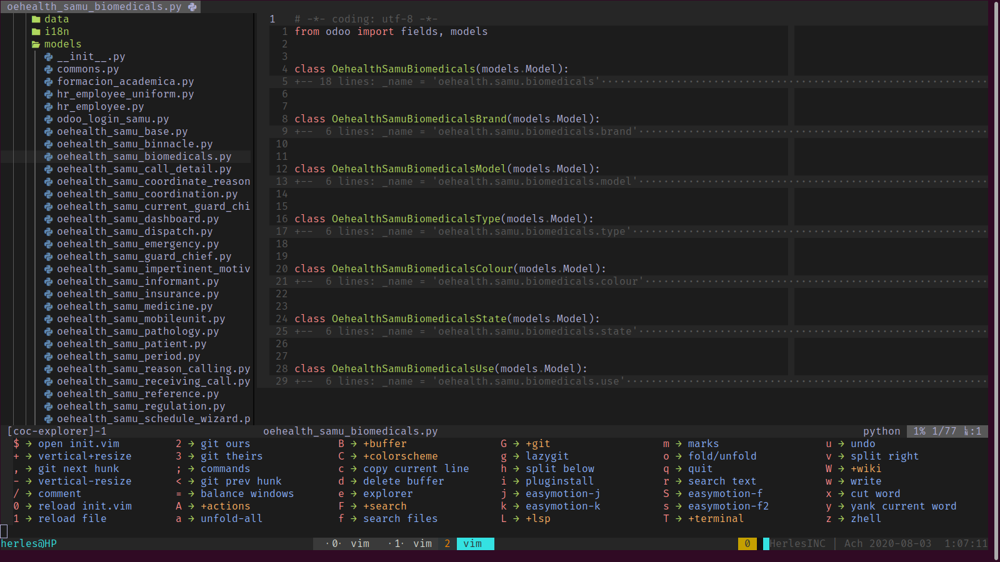

# Nvim DevHerles



## Install in one command

The following will install this config if you have an existing config it will move it to `~/.config/nvim.old`

This script only supports Ubuntu

```sh
bash <(curl -s https://raw.githubusercontent.com/DevHerles/nvim/master/utils/install.sh)
```

## Installing Oracle SDK (for coc-xml)

### Downloading SDK binaries

Download SDK binaries in .tar.gz (tarball) by heading over to their [website](https://www.oracle.com/java/technologies/javase/javase-jdk8-downloads.html)

### Installing

Create a directory to install SDK in with:

```sh
sudo mkdir /usr/local/java
```

Move the SDK binaries into the directory:

```sh
sudo mv jdk-8u261-linux-x64.tar.gz /usr/local/java
```

Go into the install directory:

```sh
cd /usr/local/java
```

Unpack the tarball:

```sh
sudo tar -xzfv jdk-8u261-linux-x64.tar.gz
```

### Post-installation steps

To save space, delete the tarball by running:

```sh
sudo rm jdk-8u261-linux-x64.tar.gz
```

Let the system know where SDK is installed:

```sh
sudo update-alternatives --install "/usr/bin/java" "java" "/usr/local/java/jdk1.8.0_26/bin/java" 1
```

You must update the previous path in coc-settings.json like:

```sh
// java
"xml.java.home": "/usr/local/java/jdk1.8.0_261",
```

Don't forgot... `:CocRestart`

After that's done, check the installation by running:

```sh
java -version

```

It should output the following:

```bash
java version "1.8.0_261"
Java(TM) SE Runtime Environment (build 1.8.0_261-b12)
Java HotSpot(TM) 64-Bit Server VM (build 25.261-b12, mixed mode)
```
